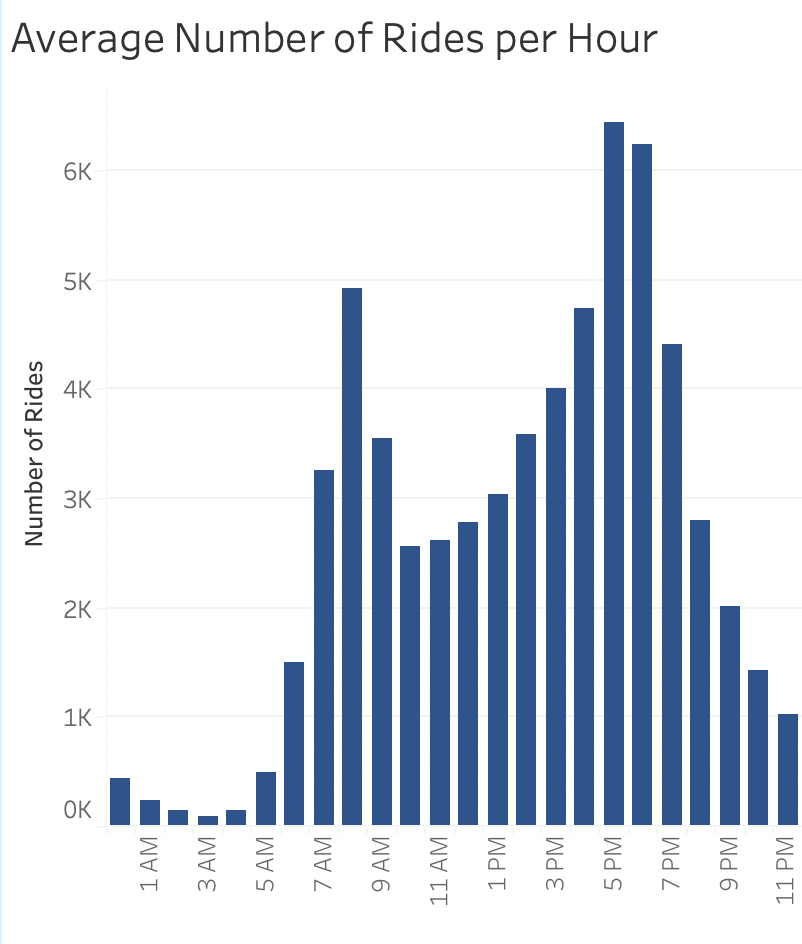
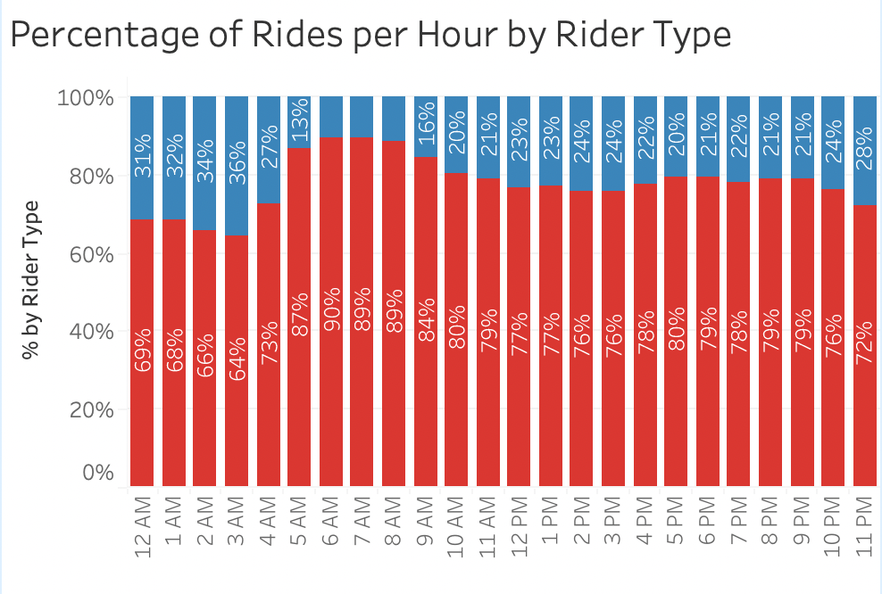
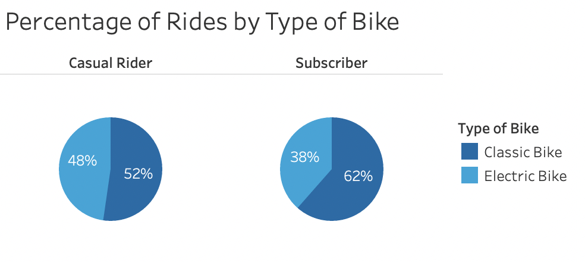

# Average Number of Rides per Hour

# Percentage of Rides per Hour by Rider Type

Citi Bike members account for a majority of the rides taken throughout the week when evaluated at a daily and hourly basis. However, the proportion of rides taken by casual riders increases between the hours of 12am and 3am on both weeknights and weekend nights. 

# Percentage of Rides by Type of Bike

Over the course of the week, Citi Bike casual riders were more inclined than subscribers to use electric bikes over classic bikes (48% of casual rides versus 38% of member rides). 

